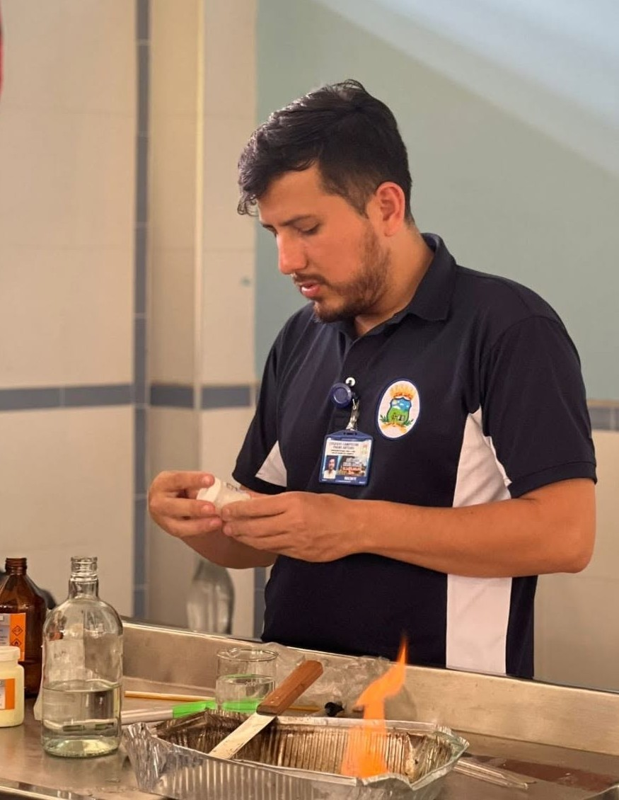

---
title: "Actividades en el aprendizaje de R"
author: "Manuel Murcia"
date: "2026-09-01"
output:
  prettydoc::html_pretty:
    theme: cayman
    highlight: github
---    

<center>


# Hola, soy Manuel Murcia
### Estudiante de la UPR Mayagüez
#### Maestría en Biología
</center>
#### Aquí se expone una serie de actividades en clase y homeworks sobre R y Rstudio. 


# Tutoriales
[Actividad 1](homework/asignacion1.html)

[Actividad 2](homework/asignacion2.html)


# Otros ejercicios en clase

## Creando una tabla de datos

| Heading 1 | Heading 2 | Heading 3 |
| --------- | --------- | --------- |
| Row 1, column 1 | Row 1, column 2 | Row 1, column 3|
| Row 2, column 1 | Row 2, column 2 | Row 2, column 3|
| Row 3, column 1 | Row 3, column 2 | Row 3, column 3|

## Creando gráficas

```{r echo=F, warning=F, message=F}
library(ggplot2)
library(palmerpenguins)

plot <- ggplot(data=penguins,
               aes(x=flipper_length_mm,
                   y=body_mass_g)) +
  geom_point(aes(color=species,
                 shape=species))

plot

```


